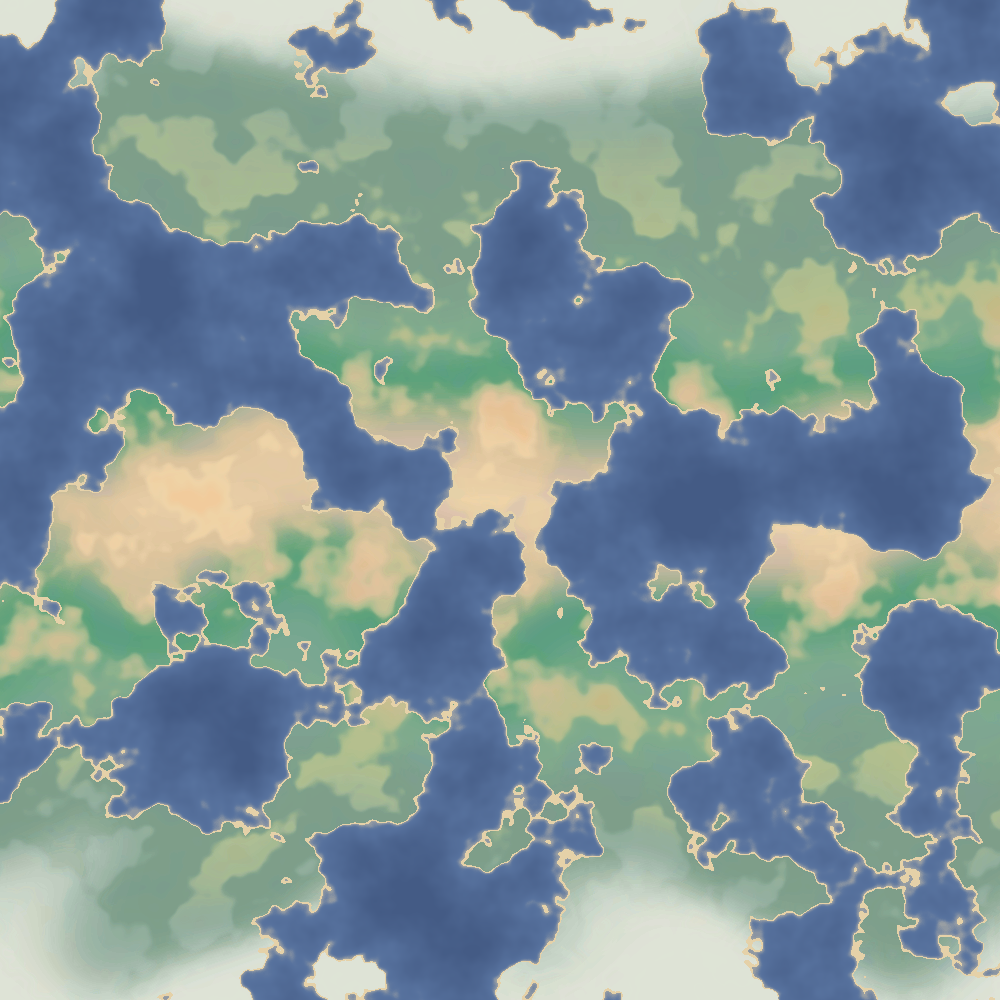
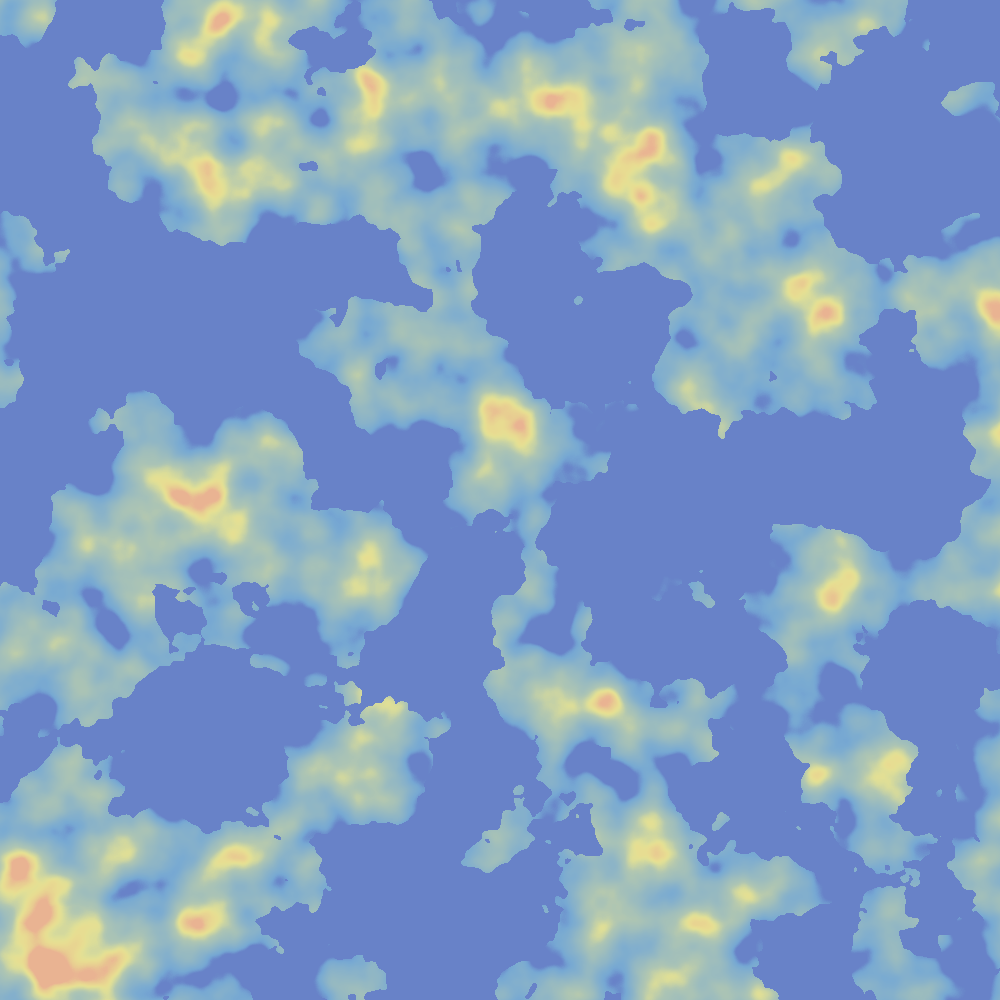
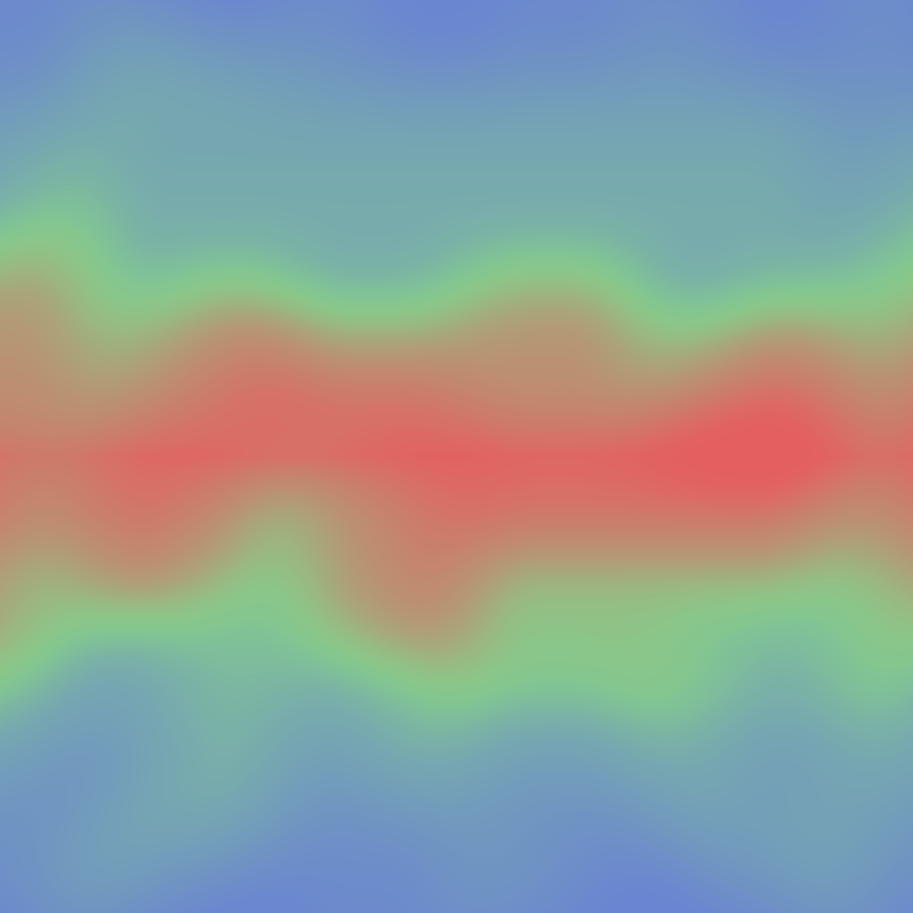
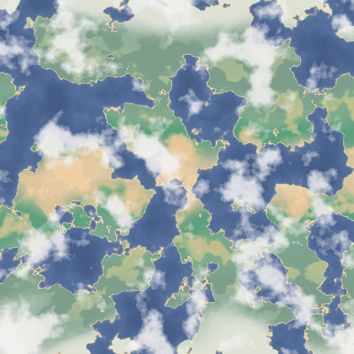
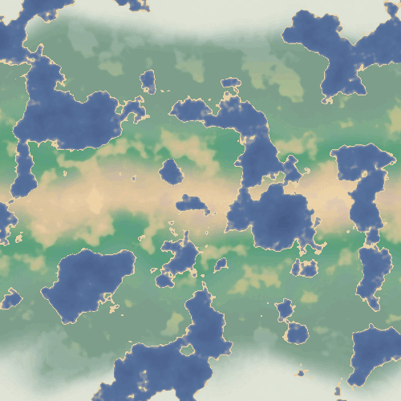

# TerrainGenerationTest
This repo is a Unity project that procedurally generates terrain images. It can also generate a sequence of images for a terrain morphing animation and a cloud moving animation :D

  

Here is the same terrain side-by-side with a visualisation of the humidity and temperature maps that were used to generate it:

  
  
  

Here is an example of a cloud animation:

  

Here is an example of a terrain morphing animation:

  

## How to run the project
If you want to have a play around, simply open this repo in Unity. Then:
- Open up the `MainScene` if it's not already open
- The scripts I wrote are attached to a `GameObject` called `Script Object`. So, you can toggle which scripts you want to run in the inspector. 

  

- `TerrainGenerator` generates a singluar image called `ColourMap.png`. Note: it will override any existing files with the same name.
- `TerrainSliceGenerator` generates a sequence of images inside the `Assets/Images/Slices` folder, for the terrain morphing animation. You will need to manually convert the sequence of pngs into a gif, I haven't figured out how to do that in Unity yet :/ (I just used ezgif.com)
- Similarly, `TerrainGeneratorWithClouds` generates a sequence of images inside the `Assets/Images/CloudSlices` folder for the cloud moving animation.
- When you press the play button, nothing happens in the scene. So just look at the console logs to get an idea of when it finishes generating (it normally takes a few seconds) and then check the folders for the generated images

Note: Most of the juicy parameters that you might want to mess with are variables in the code (because I have a love/hate relationship with public variables in the inspector lol) so I encourage you to have fun exploring!

Also, you might be a little perplexed as to why I have used Unity, because it is kinda unneccessary for a project like this. The project would probably be a lot faster and cleaner without the baggage that Unity provides. However since I am quite familiar with Unity and because I was able to save time by using assets from my other project, I went with it anyway :')