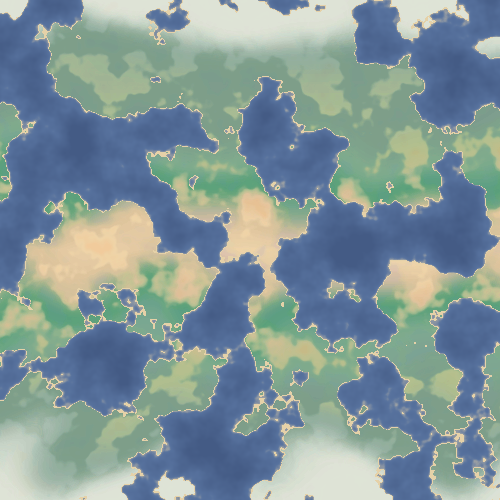
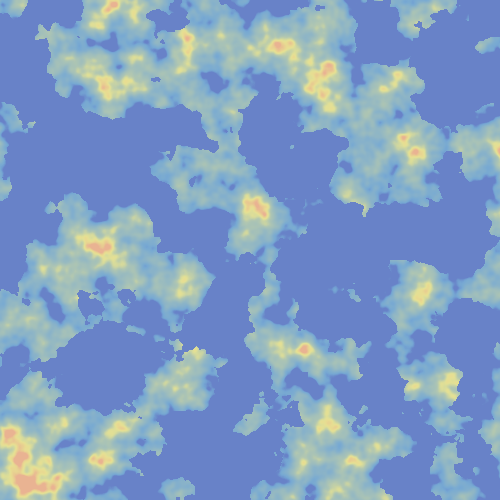
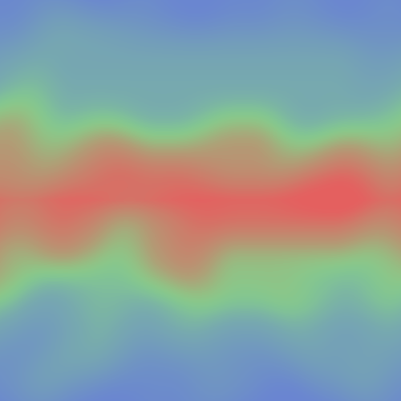

# TerrainGenerationTest
This repo contains code to procedurally generate terrain, saving it as an image. It can also generate a sequence of images for a terrain morphing animation and a cloud moving animation.

  

  
  
  

  

  

